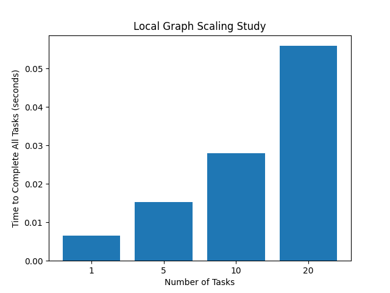
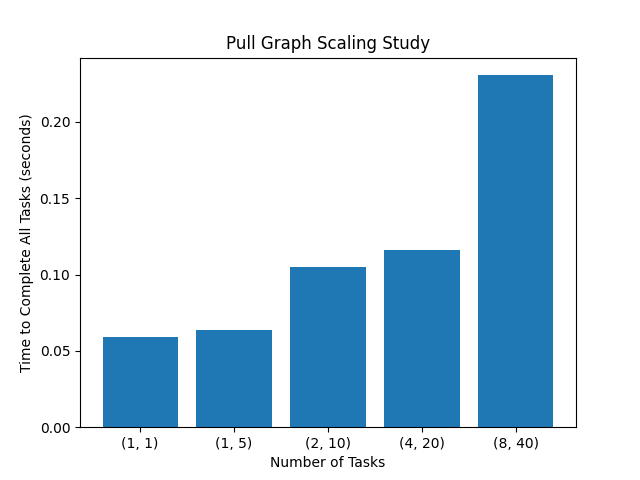
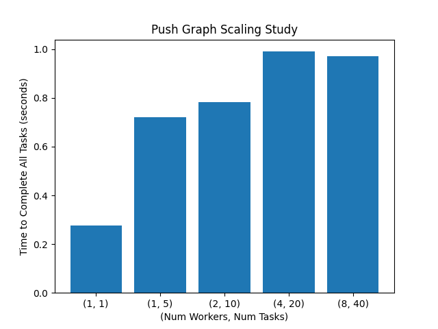

# Performance Report

For all of the following worker types you need to load up redis via `redis-server` and load up the API via `uvicorn main:app --reload`

## Local Performance Results

To run the performance tests for the local workers you must first initialize a Task Dispatcher:

```
python3 task_dispatcher.py -m local -w <num_worker_processes>
```

Then you will run the performance script to get your results:

```
sh perf/test_perf.sh local 0
```

The results will be written to the `perf.txt` file. However, we have a nice graph to display what we found!



From the graph we observe there is extremely low latency for the local worker as it does not need to commununicate over zmq at all. This is of course very nice if you need something simple done really quick that you can't do for some reason on your own computer!

What we did observe though is that it would have a very hard time running a lot of requests, demonstrated by the sample sizes we used in our graphic. This is likely because with the local worker we have no ability to scale out as we are working on this centralized system so although we get quick responses on low demand, it really falls apart when you turn up the heat. 

## Pull Performance Results

To run the performance tests for the pull workers you must first initialize a Task Dispatcher:

```
python3 task_dispatcher.py -m pull -p <port_number>
```

Then you will run the performance script to get your results:

```
sh perf/test_perf.sh pull <dispatcher_url>
```

The results will be written to the `perf.txt` file. However, we have a nice graph to display what we found!



From the graph we see

## Push Performance Results

To run the performance tests for the push workers you must first initialize a Task Dispatcher:

```
python3 task_dispatcher.py -m push -p <port_number>
```

Then you will run the performance script to get your results:

```
sh perf/test_perf.sh push <dispatcher_url>
```

The results will be written to the `perf.txt` file. However, we have a nice graph to display what we found!



From the graph we see that we have an increase in latency in comparison to the local worker [what about pull] but we have great scaling and the ability to server more tasks at once due to the ability to scale out with numerous Push Workers ready to take in work.

Also, when looking at the deployment of 1 task vs 5 we see a reasonable increase even with just one worker, this is a pretty unique jump in waittime likley implying that shipping multiple tasks may have also increased the time since from the moment a task was sent, the timer began for performance. 

## Conclusion

To conclude, each of the workers had their strengths and weaknesses. 

Ultimately it felt like if you had some lightweight work that needed to have low latency, you should definitely go for local workers. 

If you need something that can handle larger tasks but not a lot, go for pull workers since they have good turn around and are decentralized from the task dispatcher. 

If you have a lot of work to ship out and still want reasonable turn around, definitely go for Push Workers. The Dealer-Router approach is an excellent zmq style for this FAAS we are building.